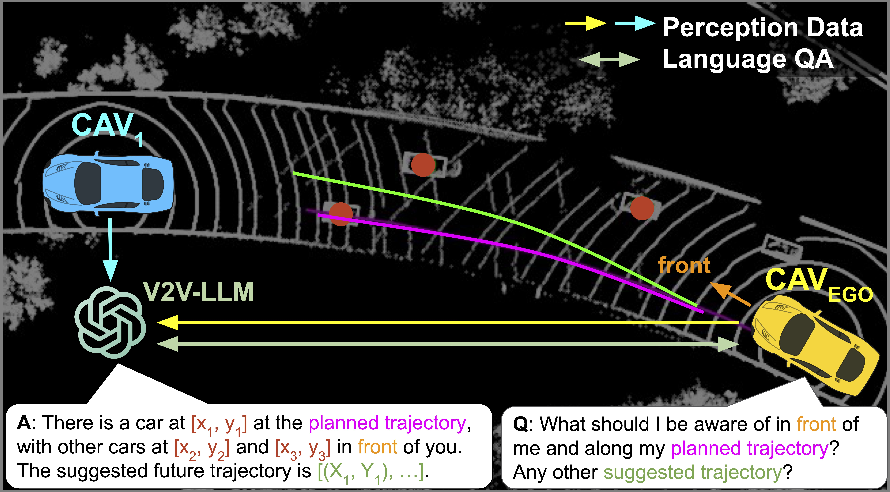

# V2V-LLM: Vehicle-to-Vehicle Cooperative Autonomous Driving with Multi-Modal Large Language Models

Hsu-kuang Chiu1,2, Ryo Hachiuma1, Chien-Yi Wang1, Stephen F. Smith2, Yu-Chiang Frank Wang1, Min-Hung Chen1

1NVIDIA Research, 2Carnegie Mellon University

[project](https://eddyhkchiu.github.io/v2vllm.github.io/)  [arxiv](https://arxiv.org/abs/2502.09980)

## Overview

We propose a novel problem setting that integrates an LLM into cooperative autonomous driving, with the proposed <b>Vehicle-to-Vehicle Question-Answering (V2V-QA)</b> dataset and benchmark. We also propose our baseline method <b>Vehicle-to-Vehicle Large Language Model (V2V-LLM)</b>, which uses an LLM to fuse perception information from multiple connected autonomous vehicles (CAVs) and answer driving-related questions: grounding, notable object identification, and planning. Experimental results show that our proposed V2V-LLM can be a promising unified model architecture for performing various tasks in cooperative autonomous driving, and outperforms other baseline methods that use different fusion approaches. Our work also creates a new research direction that can improve the safety of future autonomous driving systems. For more details, please refer to our paper at <a href="https://arxiv.org/abs/2502.09980">arxiv</a>.

